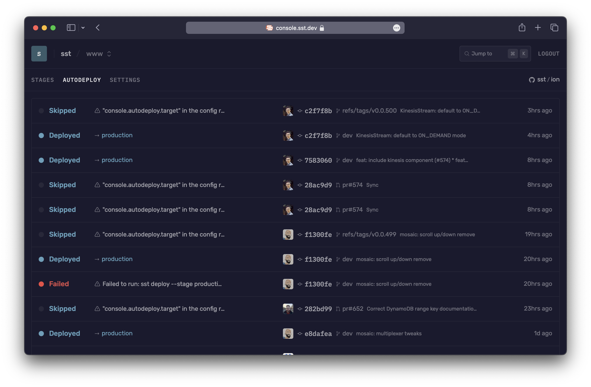

We'll deploy a python lambda that responds to a JSON payload.

---

## Preparation

To create your first lambda, [install uv](https://docs.astral.sh/uv/getting-started/installation/).

---

### 1. Create a python lambda project

Let's start by creating our function.

```bash
uv init hello-world
cd hello-world
```

This is going to create several files.

---

##### Editing the files

First, let's rename `hello.py` to `handler.py` (naming convention).

If you open the file the contents will look something like:
```py
def main():
    print("Hello from hello-world!")


if __name__ == "__main__":
    main()

```
Let's change it to the lambda format:

```py
def main(event, context):
  try:
    body = json.loads(event['body'])
    param = body.get('param')
    return {
      "statusCode": 200,
      "body": json.dumps(f"Got: {param}"),
    }
  except Exception as e:
    return {
      "statusCode": 500,
      "body": json.dumps(f"An error occurred: {str(e)}"),
    }
```

---

##### Adding dependencies

To add a dependency like `boto3`:

```bash
uv add boto3
```

This will add the dependency to pyproject.toml, it will automatically be installed on the lambda when deployed.

---

##### Adding to SST

First let's add the lambda to SST:
```
const pdfWorker = new sst.aws.Function("MyLambda", {
  handler: "<path to python project>/handler.main",
  url: true,
  runtime: "python3.10",
});
```

---

##### Running

`sst dev`

You will notice it will output a url for the lambda, something like:
`https://<random string>.lambda-url.<region>.on.aws/`

Now you can use Postman or anything you desire to invoke your lambda function

---

##### Connecting to your project

You can use the SST SDK to connect to your project like so:

```js
import { Resource } from "sst";

const response = await fetch(Resource.MyLambda.url, {
  method: "POST",
  body: JSON.stringify({ param: "123" }),
});

const data = await response.json();
console.log(data)
```

---

## Connect the console

As a next step, you can setup the [SST Console](/docs/console/) to _**git push to deploy**_ your app and monitor it for any issues. 



You can [create a free account](https://console.sst.dev) and connect it to your AWS account.

